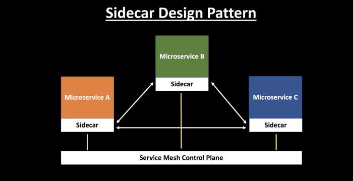

## 사이드카 패턴 (Sidecar Pattern)

### 개요
* 기본 Application 외 필요한 추가 기능을 별도의 Application으로 구현하고 이를 동일한 프로세스 또는 컨테이너 내부에 배치
* 저장 공간, 네트워크 등의 리소스를 공유하며 모니터링, 로깅, 프록시 등의 동작 가능
* 컨테이너와 함께 사용되는 경우가 많으며 사이드카 컨테이너 또는 사이드킥 컨테이너라고도 한다.

### 장점
* 사이드카 장애/수정/변경시 어플리케이션이 영향을 받지 않는다. (isolation)
* 기본 애플리케이션과 동일한 리소스에 액세스 가능
* 근접도로 인해 둘 간의 통신 시 대기 시간이 길지 않다

### 단점
* 프로세스간 통신이 많고 최적화 해야 한다면, 어플리케이션에서 함께 처리하는게 좋을 수 있다. (프로세스 간 통신을 최적화해야 할 경우로는 적합하지 않다)

### 예
* 보안을 위해 사이드카로 NGINX reverse proxy 등을 붙여서 HTTPS 통신을 한다.
* 성능을 위해 사이드카로 NGINX content cache 등을 붙인다.
* 컨테이너 외부로 로그를 모으기 위해 logstash, fluentd 등을 붙인다. (centralized logging)
* 특사 사이드카 : 특사 서비스를 사이드카로 배포
* 오프로드 프록시 : 정적 파일 콘텐츠를 처리하도록 NGINX 프록시를 node.js 서비스 인스턴스 앞에 배치
-> 모두 어플리케이션 변경 없이, 사이드카를 붙였다 떼거나 교체하기 쉬운 구성 방식. 예를 들어, content cache를 NGINX 대신 Apache HTTP server로 교체하는 등의 작업을 해도 어플리케이션은 영향을 받지 않는다.

### 참고
* [사이드카 패턴 - Cloud Design Patterns | Microsoft Docs](https://docs.microsoft.com/ko-kr/azure/architecture/patterns/sidecar)
