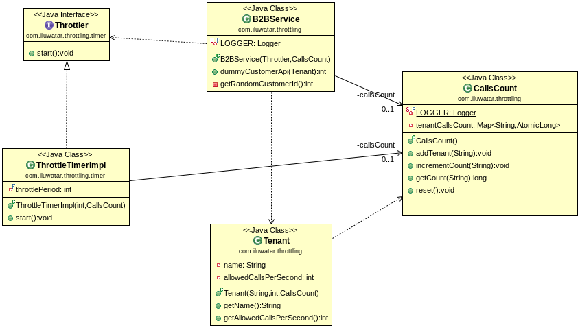

## Throttling Patterns

### 개요
* 개별 tenant가 전체 서비스에서 사용하는 리소스를 제어해야 할 때 사용


### 구현 상세
* **Tenant** : 서비스를 사용하는 tenant. 초당 실행 제한 횟수를 가지고 있다.
* **CallsCount** : tenant 당 현재까지 실행된 횟수를 관리한다.
`val tenantCallsCount = ConcurrentHashMap<String, AtomicInteger>()`
* **Throttler** : 일정 시간 마다 전체 tenant들의 실행횟수를 초기화한다.
```kotlin
override fun start() {
	Timer(true).schedule(object:TimerTask() {
		override fun run() { callsCount.reset() }
		}, 0, throttlePeriod)
}
```
* **Service** : 실행 횟수를 실제 비교하고 증가시킨다.
```kotlin
fun call(tenant: Tenant): Int? {
	 if (count.getCount(tenant.name) ?: 0 >= tenant.allowedCallsPerSecond) {
		return -1
	}
	return count.incrementCount(tenant.name)
}
```
